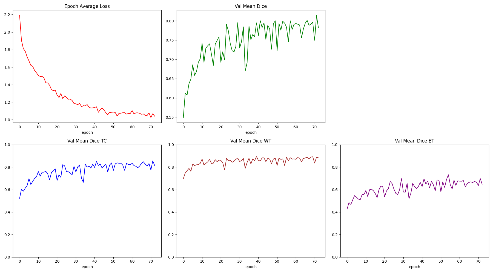
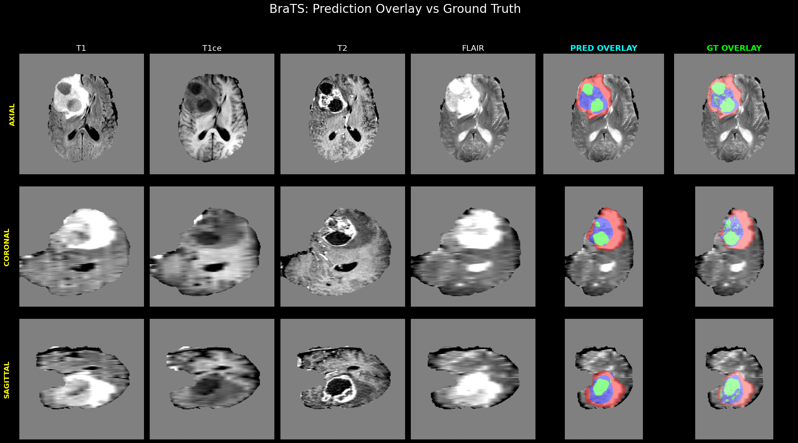

# LSNet3D BraTS Segmentation

## Overview

This repository implements a 3D brain tumor segmentation pipeline based on an LSNet3D architecture for the BraTS dataset. The model uses an LSNet encoder, a 3D CBAM-enhanced decoder, multi-scale auxiliary supervision, and a combined cross-entropy + soft Dice loss for robust tumor region segmentation.

## Key Features

- 3D LSNet-inspired backbone for volumetric medical image segmentation
- Multi-scale decoder with auxiliary heads for hierarchical supervision
- Attention-enhanced decoder blocks (CBAM-style channel + spatial attention)
- Support for BraTS raw folder format and nnU-Net `dataset.json` format
- Smart foreground cropping and data augmentation for better tumor learning
- PyTorch Lightning training pipeline with checkpointing
- BraTS evaluation metrics: ET, TC, WT Dice scores and optional HD95
- Sliding window inference and full-case visualization

## Repository Structure

- `config/segmentor.py` - Lightning `Segmentor` wrapper, training/validation step logic, optimizer/scheduler
- `config/train.py` - training entrypoint, dataset loading, trainer configuration, checkpoint saving
- `datasets/datasets.py` - BraTS data loaders for raw format and nnU-Net format
- `module/model/lsnet3d.py` - LSNet3D encoder building blocks and backbone
- `module/model/decoder3d.py` - 3D segmentation decoder with CBAM attention and aux outputs
- `loss/loss.py` - `DS_UNETR_PlusPlus_Loss` combining weighted cross entropy and soft Dice loss
- `metrics/metrics.py` - BraTS metric computations and Hausdorff distance support
- `test_model.py` - inference, sliding window evaluation, visualization, report generation
- `requirements.txt` - Python package dependencies

## Installation

1. Create a Python virtual environment:

```bash
python -m venv venv
```

2. Activate the environment:

```bash
# Windows PowerShell
venv\Scripts\Activate.ps1
```

3. Install dependencies:

```bash
pip install -r requirements.txt
```

4. Optional for HD95 evaluation:

```bash
pip install scipy
```

## Data Preparation

The project supports two BraTS dataset layouts:

1. Raw BraTS folder structure:
   - One folder per patient
   - Each folder contains `*_t1.nii`, `*_t1ce.nii`, `*_t2.nii`, `*_flair.nii`, and `*_seg.nii`

2. nnU-Net format with `dataset.json`:
   - `imagesTr/` and `labelsTr/`
   - A standard `dataset.json` file describing training files

Set the root path for your BraTS data using the environment variable `BRATS_DATA_DIR` or update the base directory inside `config/train.py` and `test_model.py`.

Example:

```bash
$env:BRATS_DATA_DIR = "E:\\3D SEGMENTATION BraTs\\datasets\\BraTS"
```

## Training

Run training from the repository root:

```bash
python config/train.py
```

The script will:

- auto-detect GPU or CPU
- load BraTS data either from raw folders or nnU-Net format
- use `LSNet3D_Seg` as the segmentation model
- save checkpoints to `./weight/BraTS/`
- log validation Dice scores and save the best model by `val_dice_avg`

### Training configuration

- batch size: `4`
- crop size: `64^3`
- optimizer: `AdamW`
- initial learning rate: `1e-4`
- scheduler: `ReduceLROnPlateau` monitored by `val_dice_avg`
- mixed precision on GPU: `16-bit`

## Inference and Evaluation

Use `test_model.py` for inference and visualization. Update `checkpoint_path` inside the script or modify it to point to your trained `.ckpt` file.

Example:

```bash
python test_model.py
```

`test_model.py` includes:

- sliding window inference for large volumes
- support for both raw BraTS and nnU-Net input formats
- full-case report visualization comparing T1/T1ce/T2/FLAIR, predictions, and ground truth

## Model Architecture

### Encoder

- `module/model/lsnet3d.py` defines the 3D LSNet encoder
- uses dynamic large-kernel perception (`LKP3D`) and small-kernel aggregation (`SKA3D`)
- alternates between RepVGG-style depthwise blocks and LSNet blocks
- includes 3D attention and feed-forward residual units

### Decoder

- `module/model/decoder3d.py` defines the segmentation decoder
- upsamples encoder features step-by-step from coarse to high-resolution volumes
- uses CBAM-style attention after each upsample stage
- produces a main segmentation output plus auxiliary outputs for deep supervision

### Loss

- `loss/loss.py` implements `DS_UNETR_PlusPlus_Loss`
- combines weighted cross entropy and soft Dice loss
- designed for 4-class segmentation: background + tumor subregions

### Metrics

- `metrics/metrics.py` computes BraTS Dice for:
  - Enhancing tumor (ET)
  - Tumor core (TC)
  - Whole tumor (WT)
- also includes optional Hausdorff distance (HD95) support if `scipy` is installed

## Results & Visualization

### Training Metrics
The model training produces comprehensive metric tracking across validation stages:



### Inference Visualization
Example segmentation output showing multi-view visualization with brain overlays:
- Left columns: Original T1, T1ce, T2, FLAIR modalities
- Middle: Predicted segmentation overlay on brain images
- Right: Ground truth segmentation overlay
- Color mapping: Red (NCR/NET), Green (Edema), Blue (Enhancing Tumor)



## Notes

- The model expects 4-channel MRI input: T1, T1ce, T2, FLAIR
- Output is a 4-class segmentation map with labels: background, NCR/NET, edema, enhancing tumor
- Data normalization is applied per modality using brain region statistics
- Smart cropping focuses training on tumor-containing regions while preserving random background crops
- Segmentation overlays display predictions and ground truth directly on brain tissue for clinical interpretability

## Contact

For questions or further improvements, inspect:

- `config/train.py`
- `config/segmentor.py`
- `datasets/datasets.py`
- `module/model/lsnet3d.py`
- `module/model/decoder3d.py`
- `test_model.py`
